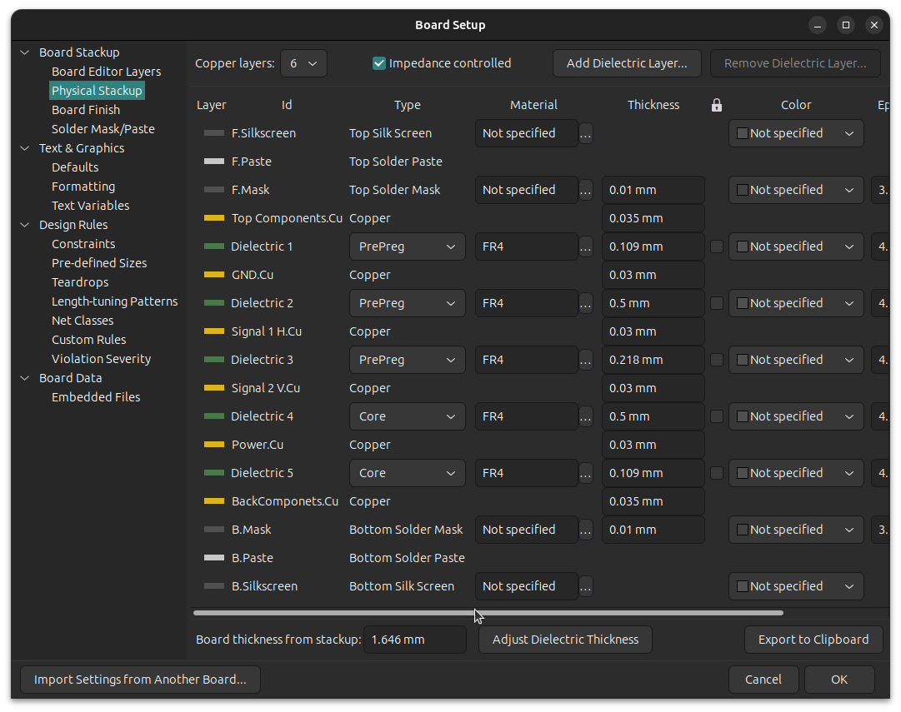
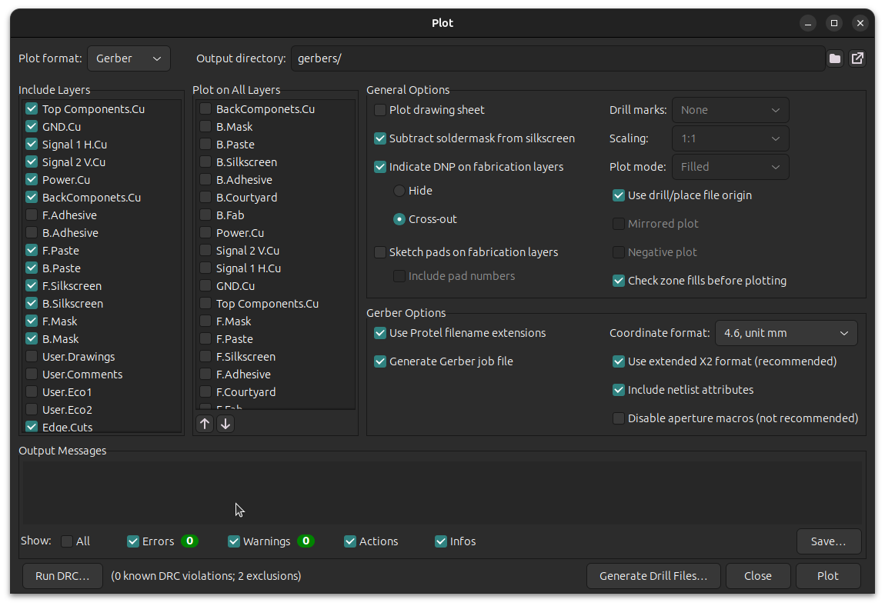
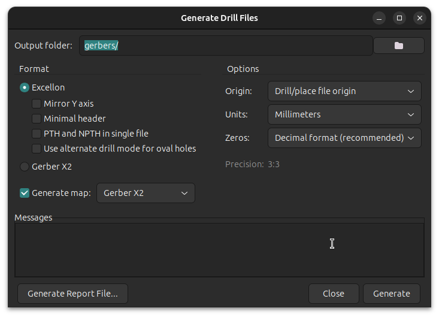
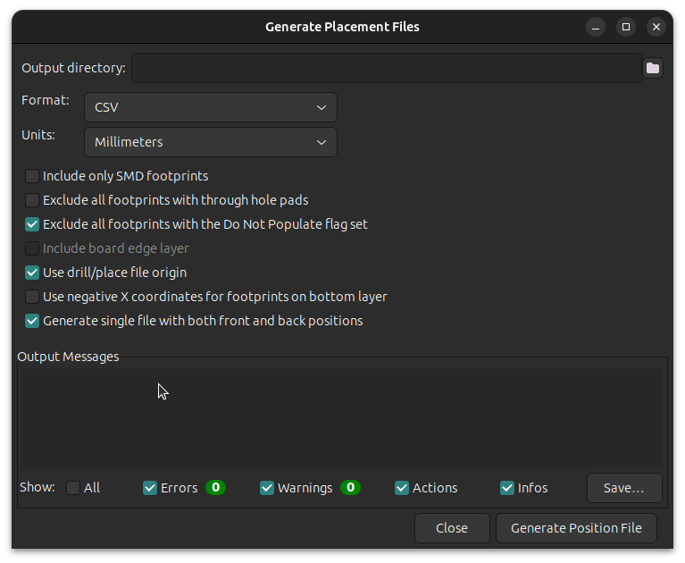

This document describes design and debugging information for the
PACSAT AFSK board.

This document mostly describes internals to the board.  For information
on external connections, see the ICD document.

Copyright Corey Minyard, 2026
Licensed under CC BY-SA 4.0

# Getting the Design Ready to Build

You deliver three basic components to the board manufacturer: A BOM
(Bill of Materials), a placement/position file (pos), and gerbers.

Outgassing may need to be handled for the inductors and the SCPS-4-62+
RF splitter.  MiniCircuits said they can build the splitter with a
special epoxy for space.  Inductors needs to be sourced from Coilcraft
for space.

To generate the files for a build, do the following from the main
PacSatFSKBoard directory:

Remove the old files:
```
  rm -r gerbers PacSat_AFSK.csv PacSat_AFSK-all-pos.csv
```

On the PCB Editor window in KiCad, click on "File", then "Fabrication
Outputs", then "Bill of Materials".  Use the defaults there and save
it under the default name, `PacSat_AFSK.csv`.

Under the same menu now choose "Component Placement" and use the
defaults, except *IMPORTANT* click on "Exclude all components with the
Do No Populate flag set" box.  For some reason that setting doesn't
get saved.  Then save it under the default name
`PacSat_AFSK-all-pos.csv`.  This is placement for both sides of the
board.  Then close this window.

Under the same menu now choose "Gerbers" and use the defaults.  It
saves by default in the output directory "gerbers".  Click on
"Generate Drill Files" and generate those.  Close that window then click
on "Plot" then close the window.

A section at the end of this file has pictures of the various windows
used for generating the outputs.

Now you must process the files to make them suitable.  I'm going to
put the output files in a PacSat directory in my home directory.
Do the following:
```
  ./FixupBOM.py PacSat_AFSK.csv ~/PacSat/PacSat_AFSK-bom.csv
  ./FixupPOS.py PacSat_AFSK-all-pos.csv >~/PacSat/PacSat_AFSK-pos.csv
  zip -r ~/PacSat/PacSat_AFSK-gerbers.zip gerbers/
```

Send those three files (PacSat\_AFSK-bom.csv, PacSat\_AFSK-pos.csv, and
PacSat\_AFSK-gerbers.zip) to your board manufacturer.

Take a picture of the "Board Physical Stackup" under the Board Setup
screen and send that with these files so the board stack is
documented.

Add the following notes:

* Apply solder normally to the pad under U3 (the clock chip) even
  though it doesn't have a pad on the chip itself.  The solder
  will melt against the chip and supply a thermal path to the board.

* Same as above for U2 (the CPU chip).

# Setting up the USB chip

The first thing you must do is program the USB chip.  This is done
with the Infineon USB Configuration Utility and must be done on a
Windows machine, unfortunately.

Start the utility, plug the board in to a USB port, choose "Select
Target" then select the device (it should be the only one) and click
on "Connect".

Click on SCB 0.  It should be in UART mode.  Click on "Configure" and
set to 2-pin mode, 38400N81.  Then go to SCB 1 and do the same, except
set it to 9600N81.

Click on CapSense/BCD/GPIO and click on "Configure" by "Unused GPIO's
drive mode".  GPIOs 2, 3, 4, and 9 should all be set to "Drive 0".
The rest should be tristate.

The GPIO pins on the USB device can be controlled with the cygpio
command in the hostutils/linux directory in the PacSatSw repository.

# Initial Board Programming

The first thing you must do is program the main software onto the main
CPU (TMS570) with Code Composer Studio 12.8.1 through the debug port.
You need an XDS110 device of some kind, see the next section for
details on that and hooking up a serial port.

It's recommended to power with USB while doing this.  Using the cygpio
utility, enable power and disable the watchdog with:

```
$ sudo cygpio 1 nowdog 1
$ sudo cygpio 1 power 1
```

which will disable the external watchdog timer and enable the power.
Note: Don't enable power here if you have external power applied
through the PC104.  When programming with the XDS110 at any time, you
need to disable the watchdog timer.  You don't want it resetting the
CPU while programming.

After that you can program the main CPU with JTAG.

On the main CPU serial port you should see it boot.  It will enable
the ACP by default, but that must be programmed, too, to work.

To program that, pull up Code Composer Studio 20.5.0 or later and load
the PacSatSPII2CSysconfig workspace.  This contains the internal
configuration for the device and must be programmed first before
anything else will work.  Failing here can brick the chip.  But it's
small and not likely to fail.

After that, program the PacSatSPII2C workspace to get the normal
software on the ACP.

After this, the board should be functional.

# Hooking Up JTAG and a serial port

The board uses a standard 10-pin 2x5 1.27mm pitch JTAG connector for a
debugger hookup.  The standard TI XDS110 debugger should work, though
I have not tried it.  I am using an LP-XDS110 from TI
(https://www.ti.com/tool/LP-XDS110).  You will need to get a cable,
since that doesn't come with the debugger board.  You can get one
at https://www.adafruit.com/product/1675
or https://www.digikey.com/en/products/detail/olimex-ltd/ARM-JTAG-20-10/3471401

Besides being a lot cheaper than the standard XDS110, the LP-XDS110
also has a serial port built in, so you don't have to have a separate
serial port interface.

On version 2 boards, jumper J12 is the serial interface (3.3V) and the
TX and RX lines are labeled under the pins.  The unlabeled pin is
ground.

On version 3 boards, there are two CPUs and two serial ports.  The
serial port for the main CPU is on PC104 J2, TX is pin 2 and RX is
pin 1.  The serial port for the antenna controller is on J1, TX is pin
2 and RX is pin 1.

Remember, hook TX on one board to RX on the other.  Don't
hook TX to TX.  If you don't have the JTAG connected, you will need to
connect the ground as well.

The serial port connections to the PC104 are removed after version 3
now that the USB interface has been proven.

For version 3 and later boards, the serial ports are available via a
USB to serial converter.  The first serial port is the main CPU and
the second is the antenna controller.  On version 3 boards, do not
hook up the serial port lines on the PC104 if USB is connected, they
are the same lines.  On version 4 and later USB is the only way to
hook to the serial port.

The reset button on the LP-XDS110 resets the board.

The jumper on the LP-XDS110 decides which device powers the level
shifters.  If you are just using the serial port, the jumper should be
set to "XDS".  Otherwise the level shifters won't get power and they
won't work very well (you get erratic behavior).  If you have the JTAG
connector hooked up, the jumper should be set to "EXT" (or "TGT").
Otherwise the LP-XDS110 will be providing power to the device, which
you don't want.  In that case the PacSat board is powering the level
shifters.

# Hooking Up Power

## Version 2

Version 2 boards build only takes 5V.  There is a build option (or
some solder work) to remove the 3.3V regulator and supply 3.3V through
an external interface.

To hook up 5V, you can use jumper J5 (which is right by the PC104).
The 5V pin is labeled on the board.  Or you can use PC104 connector J2
(H2) pin 25 or 26 for 5V.

For external 3.3V, remove U4, R119, and R120.  Then 3.3V comes in
jumper J6.  This could also be done from the PC104 J2 (H2) pin 27 or
28, but you would need to add resistor R111, which is not installed by
default, or one of the other 3.3V entry points on the PC104, also not
installed by default.

You obviously must hook up ground.  On the PC104 this is J2 (H2) pins
29, 30, and 32.  The other power pins have an associated ground.

There are also other pins on the PC104 which can supply 5V and 3.3V,
matching some power supplies, but certain resistors need to be
installed to do this.  They are not installed by default.

## Version 3 and later

Version 3 and later boards do not have the 3.3V regulator, you must
supply both 5V and 3.3V.  There are unpopulated headers on the board
that you can install to supply power, but it's recommended to go
through the PC104 or USB to supply power.  Really, USB is the
simplest, so unless you need to measure power usage, just use USB.
The PC104 pins are the same ones as used for the Version 2 board.

If you need to power from some other voltage, there is space to add a
buck regulator like a TPS61379-Q1 by the PC104 connector.  Or a
buck-boost or other options.  Currently this assumes that incoming
power is stable +5V and +3.3V.

See the USB section for details on powering from that.

# USB

(Version 3 and later boards only.)

There is a type C USB connector on the board.  It has two functions:
accessing the serial port on the processor and powering the board when
the satellite is completely assembled and otherwise inaccessible.

The USB chip, a CY7C65215, should be configured first before using the
board.  See "Setting Up the USB Chip" for details.

## USB Serial Ports

The serial ports to the main processor and the antenna control
processor are available through a USB to serial converter.  The first
is the main CPU and the second is the ACP.  They are standard USB
serial devices, so no special drivers should be needed.

On version 3 boards, if USB is plugged in, do not connect to the
serial lines on the PC104.  The same lines go to the USB to serial
converter and are driven by that chip.

## USB Power

The USB circuitry is powered by the USB interface.  If a USB cable is
not plugged in, it will not be powered, the USB power interface is
designed to block power from flowing from the main power rails to the
USB circuits.

If USB is plugged in, can provide power to the board through the USB
interface.  This is controlled by GPIO9 on the USB chip, see the main
USB section above for details.  It is off by default.

You can power the board separately and use the USB section at the same
time as long as you don't enable GPIO9 on the USB chip.

The 5V will experience some power drop due to the MOSFETs used to
switch power on.  At 1A it will sag about .24V.  The 3.3V power is
boosted a bit in the USB power converter and will range from 3.2V to
3.4V.

The design has one minor flaw.  If the USB is powered, then the 5V\_IN
main power rail will have about 4.2-4.5V on it.  This is harmless, but
annoying.  This is due to a feedback loop with the power going out of
the 5V USB power MOSFETs going into the resistor that pulls the gates
up and shuts off the power.  The voltage will be held right below the
cutoff of the 5V MOSFET gates.  The 3.3V MOSFET gates will be shut
off, their cutoff is in the 2.8V range, so it powers off the main
circuitry on the board, but you will see the power LED and a few
things will be powered.  If power is applied to the main rails from
elsewhere, it will pull op the 5V MOSFET gates and shut them off, so
it's safe to power both separately.  If a clever design to fix this
can be found, it might be fixed, but nothing has been found to date
that justifies the added complexity.

# Heat Sink for the Power Amplifier

The power amplifier has heat sink (or spreader) mounting on the bottom
of the board.  The PA is designed to transfer the heat that way,
according to the data sheet.

There is space and mounting holes for a 26mm by 12mm heat sink.
Mounting holes are M1.6 sized PTH centered 2.25mm from each edge.
The idea is to have a flat copper plat of that size.

The mounting hole centers are 21.5mm apart horizontally and 7.5mm
apart vertically.

Near the center of the plate there is a small block of copper to
extend down to the circuit board under the PA.  The PA has an open
copper area for this.  This area is 3.5mm x 3.5mm.  It's right edge
is located 13.60mm from the right side of the plate and the left edge
is located 8.7mm from the left side of the plate.  The top of the
area is 4.35mm from the top of the plate and 4.15mm from the bottom of
the plate.

It is unknown if the heat sink is required or what duty cycle on the
PA can be supported with and without it.  There is already a large
ground area on the bottom of the board for cooling.  But the provision
is there.  At worst case it needs to dissipate around 2W of heat. (The
PA is powered but no signal is transmitted.  When a signal is being
transmitted at full power, most of the power is being sent and only
around .5W is being dissipated by the PA.  It may also be possible to
reduce the quiescent current drawn by the PA by modifying the Iref
current using the DAC on a Version 3 or later board.

It would also be possible to connect the top of the chip via some type
of riser to the shield to provide additional radiation surfaces for
the PA.  Experience has shown that most of the head goes to the bottom
of the chip and not to the top, but it could help a little.

On Amazon you can search for "copper flat bar" to find suitable
material.  The PA is .85mm tall, the shield is 2.54mm, leaving 1.69mm
(.067") of space between the shield and the PA.  A 1/16" (.0625) will
probably work for a connection from the PA to the shield, though it
might be a tad too thick.  It could be sanded a bit.

You would probably want a 1/8" thick bar for the heat sink on the
bottom.  You could use a 2.75mm square piece of it to place on the PA
pad then put a 12mm x 26mm (.47" x 1") piece on top of that, drill 2mm
holes, and screw it down.  There's a little bit of slack on the large
piece dimensions, 1/2" width would be fine, adding a bit to the length
would be ok, too.

The board is ~1.6mm thick, 1/4" is 6.32mm, so that's 7.92mm.  You can
find M1.6 x 10mm stainless steel screws on Amazon along with nuts that
should work to fasten down the heat sink.  You would also need a space
grade thermal adhesive or paste.

# RF Connections

See the ICD document.

# RF Loopback Testing

The Transmit AX5043 has an 18nH inductor installed for its PLL.  This
doesn't seem to affect ranging at 435MHz, but it allows it to range in
the 145MHz area, too.

You can use this to do a loopback test, transmit out in the 145MHz
area and receive there, too.  The receiver will pick up stray output
from the transmitter on the board, but the power will be very low.
(This was tested without shields, shields might eliminate that.)  When
going out the antenna port to a nearby antenna and then back in, the
power will be much stronger.

This should work through the diplexer, if that is installed, but you
can't test the actual antennas in that case.

With this, it is possible to test the entire RF chain.

# Hardware Watchdog

The USB interface GPIO_3 can be set to 1 to disable the watchdog
timer.  When programming and debugging you need to disable the
watchdog.

R161 can also be installed to disable the watchdog timer.

# I2C

I2C can be run to the PC104.  These are on J1 (H1) pins 41 and 43,
which is semi-standard.

On version 3 and later boards, U32 and U38 must be installed (the
default) and then the PC104\_I2C\_EN\_N line must be enabled to turn
on access to this.  To permanently add a connection, U32 and U38 can
be removed and a 0402 zero-ohm resistor connected between pins 2 and 4
on both devices.

On version 2 boards, resistors R113 and R122 need to be installed.

The TMS570 processor provides pull ups for the I2C lines, so external
ones are not necessary.

# CAN Bus

Two CAN buses are routed to the PC104 and they are on by default.  CAN
A is on H1 (J1) pins 5 (the +) and 6 (the -).  CAN B is on H1 (J1)
pins 33 (the +) and 34 (the -).

CAN A is routed to CAN3 on the CPU, and CAN B is routed to CAN2 on the
CPU.  That is a bit confusing.

These are not standard.  I found the NanoMind device specifies a CAN
bus on H2 pins 1 and 5, but they are differential and need to be
beside one another.

CAN A can be disabled by removing U14 and R50 and R51.  CAN B can be
disabled by removing U22 and R89 and R90.

# PC104 Serial Port

The second serial port from the processor is run to PC104 J2 (H2) pins
22 (RX) and 21 (TX).

On version 3 and later boards, U39 and U40 must be installed (the
default) and then the PC104\_SER\_EN\_N line must be enabled to turn
on access to this.  To permanently add a connection, U39 and U40 can
be removed and a 0402 zero-ohm resistor connected between pins 2 and 4
on both devices.

On version 2 boards, You need to install R123 and R124 to make this
connection.  However, RX and TX are backwards so special jumpering on
R123 and R124 will be required to make it work.

# Differences between the Version 2 and Version 3 board

* The ACTIVE\_N GPIO is now ACTIVE, changed to positive logic.

* The OTHER\_FAULT\_N GPIO is now OTHER\_FAULT, changed to positive
  logic.

* The OTHER\_HW\_POWER\_OFF\_N GPIO is changed to
  OTHER\_HW\_POWER\_ST.  It is now positive logic, and the name has
  been changed to reflect that it is measuring the other power off
  state.

* OTHER\_ACTIVE\_N has changed to positive logic, OTHER\_ACTIVE now.

* A DAC has been added to the AX5043 SPI bus to control the quiescent
  current into the PA.  This should allow the power usage of the PA to
  be directly controlled.  There is also an uninstalled resistor that
  can be installed (and the DAC removed) as a build option.

* The serial RX and TX lines on the PC104 were backwards on the
  version 2 board.  They are fixed on the version 3 board.

* Unfortunately, CAN A was moved on the PC104 from pins 23 (+) and 24
  (-) to pins 5 (+) and 6 (-).  Pins 23 and 24 are already used on the
  power supply for ground and alternate I2C, so they could not be used
  for CAN.

* Switches were added for connecting the I2C and serial lines to the
  PC104.  They are controlled by PC104\_I2C\_EN\_N and
  PC104\_SER\_EN\_N.
  
* There is a thermsistor added by the oscillator for frequency tuning,
  and for general temperature measurement.  This goes into AD1IN[09].

* The RTC has been redesigned so it works better when not powered.
  The version 2 RTC had a diode with too much leakage and insufficient
  capacitance.  The main power to the RTC also dropped too fast for it
  to take over from battery power.  The main power has a diode and
  capacitance added to slow the voltage drop there, and the diode has
  been replaced with a low leakage one and the capacitance has been
  increased.  In Version 2 the software sets up the RTC to be powered
  only by battery to avoid the main power drop issue, this will no
  longer be required on Version 3.
  
* PA\_PWR\_EN is now positive logic to account for the external PA
  power control changes.

* SPI 5 from the processor is run to an antenna controller
  and switches were added to allow ANT\_EN\_N to turn on the
  antenna controller
  
* Pin 9, GIOA[2] was changed from OTHER\_PRESENCE\_N to ANT\_IRQ\_N.
  OTHER\_PRESENCE\_N didn't need to be on a line with an interrupt,
  and ANT\_IRQ\_N obviously does.  OTHER\_PRESENCE\_N is moved to
  pin 86, AD1EVT.
  
* PC104\_GPIO4 and ACTIVE are switched.  PC104\_GPIO4 is now pin 133
  (GIOB[1]) and ACTIVE is now N2HET1\_18.  ACTIVE would not need to be
  used as an interrupt as it is output only, but PC104\_GPIO4 could,
  and if we need another interrupt input into the main CPU from
  something else PC104\_GPIO4 could be used for that.

* The CANB connections to the PC104 connector were not on the partial
  PC104 connector.  Move them to be on that connector in case this
  interfaces to a board with a partial PC104.  This moves them from
  H1-33 and H1-34 to H1-29 and H1-30.
  
* The ABF0 line from the power supply is run to PC104\_ABF0 on the
  CPU.  This goes through a MOSFET to avoid latch up and to isolate,
  so the logic is inverted from the PC104.
  
# Differences between the Version 3 and Version 4 board

Version 4 boards do not have the serial ports run to the PC104 connector.

The version 4 board has PC104\_I2C\_EN and PC104\_SER\_EN positive
logic, those were negative logic on the version 3 board.

The version 4 boards no longer have a watchdog disable jumper.  That
is accomplished from the USB chip now.

The version 4 boards no longer have plugs for +5V and +3.3V.  Use the
PC104 or USB for power.

The version 4 boards have the bootstrap load invoke lines run to the
USB chip to allow the USB chip to invoke a bootstrap without having to
do anything physical to the board.

# IO Connections on the PacSat AFSK processor

These are the pins on the TMS570 processor, where they go, what they
do and some notes at the end with some more details.

The "G" column shows the GPIO usage and capability.  The first letter
is how the GPIO is used: I for input, O for output, B for
bidirectional, blank if not used as a GPIO, and ? if the function is
not known (the PC104 pins).  The second letter is U for pullup by
default and D for pulldown by default or blank if the pin cannot be
used as a GPIO.

|Pin	|CPU Pin Name			|Schematic Name			|G |Description |
|----	|------------			|--------------			|--|----------- |
|1		|GIOB[3]				|OTHER\_FAULT			|ID|Fault line from other board|
|2		|GIOA[0]				|PC104\_GPIO1			| D|PC104 pin H2-11|
|3		|MIBSPI3NCS[3]			|I2C\_SCL				|OU|RTC control (MAX31331TETB+) |
|4		|MIBSPI3NCS[2]			|I2C\_SDA				|BU|RTC control (MAX31331TETB+) |
|5		|GIOA[1]				|AX5043\_IRQ\_RX1		|ID|Interrupt from AX5043 RX1 |
|6		|N2HET1[11]				|OTHER\_HW\_POWER\_ST   |ID|Power off state for the other board |
|7		|FLTP1					|						|  | |
|8		|FLTP2					|						|  | |
|9		|GIOA[2]				|ANT\_IRQ\_N			|ID|Interrupt from the antenna control chip |
|10		|VCCIO					|						|  | |
|11		|VSS					|						|  | |
|12		|CAN3RX					|CAN\_A\_RX				|IU|CAN bus transceiver |
|13		|CAN3TX					|CAN\_A\_TX				|OU|CAN bus transceiver |
|14		|GIOA[5]				|AX5043\_IRQ\_RX4		|ID|Interrupt from AX5043 RX4 |
|15		|N2HET1[22]				|PC104\_ABF0			|ID|PC104 Pin H2-50 through a MOSFET|
|16		|GIOA[6]				|OTHER\_ACTIVE			|ID|Active line from other board |
|17		|VCC					|						|  | |
|18		|OSCIN					|						|  | |
|19		|Kelvin\_GND			|						|  | |
|20		|OSCOUT					|						|  | |
|21		|VSS					|						|  | |
|22		|GIOA[7]				|AX5043\_IRQ\_RX3		|ID|Interrupt from AX5043 RX3 |
|23		|N2HET1[01]				|						|OD|Yellow LED |
|24		|N2HET1[03]				|AX5043\_EN\_RX4\_N		|OD|Power enable for AX5043 RX 4 |
|25		|N2HET1[00]				|						|OD|Red LED |
|26		|VCCIO					|						|  | |
|27		|VSS					|						|  | |
|28		|VSS					|						|  | |
|29		|VCC					|						|  | |
|30		|N2HET1[02]				|						|OD|Green LED |
|31		|N2HET1[05]				|LNA\_ENABLE			|OD|Used to enable the LNA |
|32		|MIBSPI5NCS[0]			|ANT\_SPI\_CS			|OU|SPI for the antenna controller) |
|33		|N2HET1[07]				|AX5043\_EN\_RX3\_N		|OD|Power enable for AX5043 RX 3 |
|34		|TEST					|					    |  | |
|35		|N2HET1[09]				|AX5043\_EN\_RX2\_N		|OD|Power enable for AX5043 RX 2 |
|36		|N2HET1[04]				|AX5043\_EN\_RX1\_N		|OD|Power enable for AX5043 RX 1 |
||||||
|37		|MIBSPI3NCS[1]			|MRAM\_NCS3				|OU| |
|38		|N2HET1[06]				|UART\_RX1				|ID|PC104 pin 92 |
|39		|N2HET1[13]				|UART\_TX1				|OD|PC104 pin 88 |
|40		|MIBSPI1NCS[2]			|MRAM\_NCS2				|OU| |
|41		|N2HET1[15]				|CAN\_A\_EN\_N			|OD|CAN bus A transceiver enable |
|42		|VCCIO					|						|  | |
|43		|VSS					|						|  | |
|44		|VSS					|						|  | |
|45		|VCC					|						|  | |
|46		|nPORRST				|						|  | |
|47		|VSS					|						|  | |
|48		|VCC					|						|  | |
|49		|VCC					|						|  | |
|50		|VSS					|						|  | |
|51		|MIBSPI3SOMI			|MRAM\_MISO				|IU| |
|52		|MIBSPI3SIMO			|MRAM\_MOSI				|OU| |
|53		|MIBSPI3CLK				|MRAM\_CLK				|OU| |
|54		|MIBSPI3NENA			|MRAM\_NCS1				|OU| |
|55		|MIBSPI3NCS[0]			|MRAM\_NCS0				|OU| |
|56		|VSS					|						|  | |
|57		|VCC					|						|  | |
|58		|AD1IN[16] / AD2IN[0]	|\*						|  |Thermsistor near the processor |
|59		|AD1IN[17] / AD2IN[01]	|						|  |Board Number |
|60		|AD1IN[0]				|PC104\_ADC2			|  |ADC to PC104 H2-08|
|61		|AD1IN[07]				|PWR\_FLAG\_AX5043		|  |Power flag from the AX5043 current limiter |
|62		|AD1IN[18] / AD2IN[02]	|						|  |External Control |
|63		|AD1IN[19] / AD2IN[03]	|PC104\_ADC1			|  |ADC to PC104 H2-07 |
|64		|AD1IN[20] / AD2IN[04]	|VER\_BIT0				|  |Board version number bit 0 |
|65		|AD1IN[21] / AD2IN[05]	|VER\_BIT1				|  |Board version number bit 1 |
|66		|ADREFHI				|						|  | |
|67		|ADREFLO				|						|  | |
|68		|VSSAD					|						|  | |
|69		|VCCAD					|						|  | |
|70		|AD1IN[09] / AD2IN[09]	|						|  |Thermsistor by the oscillator |
|71		|AD1IN[01]				|VBAT					|  |Voltage from the battery rail divided by 19 |
|72		|AD1IN[10] / AD2IN[10]	|PWR\_FLAG\_5VAL		|  |Power flag from the +5VAL current limiter |
||||||
|73		|AD1IN[02]				|REV\_PWR				|  |\*Reverse RF TX Power |
|74		|AD1IN[03]				|FWD\_PWR				|  |\*Forward RF TX Power |
|75		|AD1IN[11] / AD2IN[11]	|PWR\_FLAG\_LNA			|  |Power flag from the LNA current limiter |
|76		|AD1IN[04]				|PWR\_FLAG\_SSPA		|  |Power flag from the PA current limiter |
|77		|AD1IN[12] / AD2IN[12]	|						|  |+5V power measure, linear from 0-2.5V |
|78		|AD1IN[05]				|						|  |ADC to PC104 H1-10|
|79		|AD1IN[13] / AD2IN[13]	|						|  |+1.2V power measure, 0-1.2V |
|80		|AD1IN[06]				|						|  |+3.3V power measure, 0-1.65V |
|81		|AD1IN[22] / AD2IN[06]	|						|  |ADC to PC104 H1-09|
|82		|AD1IN[14] / AD2IN[14]	|						|  |Board version number bit 2 |
|83		|AD1IN[08] / AD2IN[08]	|\*POWER\_TEMP			|  |Thermsistor in power conversion section |
|84		|AD1IN[23] / AD2IN[07]	|\*PA\_TEMP				|  |Thermsistor near the PA |
|85		|AD1IN[15] / AD2IN[15]	|						|  |Board version number bit 3 |
|86		|AD1EVT					|OTHER\_PRESENCE\_N		|ID|Presence line from other board |
|87		|VCC					|						|  | |
|88		|VSS					|						|  | |
|89		|CAN1TX					|AX5043\_EN\_TX\_N		|OU|Power enable for AX5043 TX |
|90		|CAN1RX					|AX5043\_SEL1\_N		|OU|SPI chip select for AX5043 RX1 |
|91		|N2HET1[24]				|AX5043\_SEL2\_N		|OD|SPI chip select for AX5043 RX2 |
|92		|N2HET1[26]				|AX5043\_SEL3\_N		|OD|SPI chip select for AX5043 RX3 |
|93		|MIBSPI1SIMO			|AX5043\_MOSI			|IU|SPI MOSI for all AX5043s |
|94		|MIBSPI1SOMI			|AX5043\_SIMO			|OU|SPI SIMO for all AX5043s |
|95		|MIBSPI1CLK				|AX5043\_CLK			|OU|SPI clock for all AX5043s |
|96		|MIBSPI1NENA			|AX5043\_SEL4\_N		|OU|SPI chip select for AX5043 RX4 |
|97		|MIBSPI5NENA			|AX5043\_SEL\_TX\_N		|OU|SPI chip select for AX5043 TX |
|98		|MIBSPI5SOMI[0]			|ANT\_SPI\_SOMI			| U|SPI for the antenna controller |
|99		|MIBSPI5SIMO[0]			|ANT\_SPI\_SIMO			| U|SPI for the antenna controller) |
|100	|MIBSPI5CLK				|ANT\_SPI\_CLK			| U|SPI for the antenna controller) |
|101	|VCC					|						|  | |
|102	|VSS					|						|  | |
|103	|VSS					|						|  | |
|104	|VCCIO					|						|  | |
|105	|MIBSPI1NCS[0]			|CAN\_B\_EN\_N			|OU|CAN bus B transceiver enable |
|106	|N2HET1[08]				|ANT\_EN\_N				|OD|Power control for the antenna chip|
|107	|N2HET1[28]				|PA\_DAC\_SEL\_N		|OD|Select pin for the PA DAC Iref, on the AC5043 SPI bus |
|108	|TMS					|JTAG pin				|  | |
||||||
|109	|TRST					|JTAG pin				|  | |
|110	|TDI					|JTAG pin				|  | |
|111	|TDO					|JTAG pin				|  | |
|112	|TCK					|JTAG pin				|  | |
|113	|TCK					|JTAG pin				|  | |
|114	|VCC					|						|  | |
|115	|VSS					|						|  | |
|116	|nRST					|\*Processor\_Reset		|  |Main reset pin for the processor |
|117	|nERROR					|FAULT\_N				|  |Output ERROR line from the processor|
|118	|N2HET1[10]				|OTHER\_HW\_POWER\_OFF  |OD|Power off the other board |
|119	|ECLK					|PC104\_GPIO2			|ID|PC104 pin H2-18 |
|120	|VCCIO					|						|  | |
|121	|VSS					|						|  | |
|122	|VSS					|						|  | |
|123	|VCC					|						|  | |
|124	|H2HET1[12]				|POW\_MEAS\_EN			|OD|\*TX power measurement enable |
|125	|H2HET1[14]				|PA\_PWR\_ON			|OD|Enable PA power |
|126	|GIOB[0]				|AX5043\_IRQ\_RX2		|ID|Interrupt from AX5043 RX2 |
|127	|N2HET1[30]				|PC104\_SER\_EN\_N		|OD|Connect the 2nd serial port to the PC104|
|128	|CAN2TX					|CAN\_B\_TX				|OU|CAN bus B transmit |
|129	|CAN2RX					|CAN\_B\_RX				|IU|CAN bus B receive |
|130	|MIBSPI1NCS[1]			|\*FEED\_WATCHDOG		|OU|Resets the hardware watchdog timer |
|131	|LINRX					|PC104\_RX				|IU|PC104 Pin H2-21 |
|132	|LINTX					|PC104\_TX				|OU|PC104 Pin H2-22 |
|133	|GIOB[1]				|PC104\_GPIO4			|OD|Local active output pin for active/standby |
|134	|VCCP					|						|  | |
|135	|VSS					|						|  | |
|136	|VCCIO					|						|  | |
|137	|VCC					|						|  | |
|138	|VSS					|						|  | |
|139	|N2HET1[16]				|PC104\_I2C\_EN\_N		|OD|Connect the I2C bus to the PC104|
|140	|N2HET1[18]				|ACTIVE					| D|PC104 Pin H1-27 |
|141	|N2HET1[20]				|AX5043\_PWR\_EN		|OD|Main power enable for all AX5043s |
|142	|GIOB[2]				|AX5043\_IRQ\_TX		|ID|Interrupt from AX5043 TX |
|143	|VCC					|						|  | |
|144	|VSS					|						|  | |


\*Notes below

# Interrupts and GPIOs

On the TMS570, most normal pins can also be used at GPIOs, but they
are not capable of generating interrupts.  Only the GIOx[n] pins can
generate interrupts, and they are all used for that purpose.


## Notes on thermsistors

Thermsistors are connected to ADC pins on the processor to measure
temperatures on the board.  Resistance varies from 534 ohms (125C) to
188.5K (-40C).  There is a 10K bias, so this gives this gives a .17V
(125C) to 3.13V (-40C) voltage range.  It is supposed to be fairly
linear, but does require compensation by software.

## Notes on Processor\_Reset

The 3.3V and 1.2V power converts have power good output pins, and the
1.2V current limiter has a power good pin, all open collector.  These
are wire-or-ed to the processor reset pin.  When any of them senses
there is a power issue, they will pull the reset pin.  After the 1.2V
current limiter turns on (which takes a little bit of time, it is
inrush limited) it will wait 50us and before releasing the reset pin,
so reset should happen automatically on any power up or power problem.

## Notes on FEED\_WATCHDOG

This must be toggled at least once a second.  If it isn't, the
hardware watchdog will power off the board for 200ms and power it back
on.

## Notes on TX Power Measurement

A directional coupler and power measurement chips (ADL5501AK) feed
into the ADCs (Forward power to pin 74 AD1IN[3] and reverse to pin 73
AS1IN[2]) and an enable for those parts into pin 124 N2HET1[12].  Pin
124 is pulled down by default, so the chips will be disabled at reset.
The direction coupler is 4mm long with .1524mm traces .127mm apart.
At full power out (+33dBm) this will result in about -7dBm of power
from the coupler.  This was simulated with a transmission line in
qucs.  The voltage for that can be calculated from the chip manual.

# Other IO Connections

## Antenna Control Processor (ACP)

A small M0L1228QRGERQ1 microprocessor sits on SPI 5 from the main CPU.
It's main job is to provide SPI to I2C conversion, as the TMS570 CPU
only has one I2C bus and that goes to the RTC and the PC104 connector.
The I2C busses go to the external antenna control board.  See the ICD
for pinout information.

No suitable SPI to I2C converters could be found, and even the ones
that could be found were single I2C units and would have been bigger
and cost more than this small processor.

The small processor has its own JTAG debug connector J9 near the
bottom of the board.  This processor must be independently programmed
and a protocol between the main CPU and this processor must be created
to control the processor.

The small processor may be power controlled with the ANT\_EN\_N line,
which will automatically power down the external antenna control
board, too.  As well, the external antenna control board has an
independent power controlled by the small processor on its pin 18.

On the small processor, I2C0 is connected to I2CA on the antenna
connector, and I2C2 is connected to I2CB on the antenna connector.

I2C1 runs to the I2C2 pins on the PC104, for another possible I2C.
This I2C also runs to an ADC hooked to the same connector type as the
antenna control.  This can be used for external thermsistor inputs or
really anything else where an ADC is needed.  A few extra ADCs are
available from one of the chips if they are needed.

Power to the external antenna control board comes from 3.3V_p.  Normal
power is very low, but it draws a lot of power when burning the
release cables, so a fairly large power line runs to it.  Make sure to
read the antenna documentation for the exact requirements.

|Pin	|CPU Pin Name	|Schematic Name		|Description |
|----	|------------	|--------------		|----------- |
|1		|PA0			|ACP\_RX			|UART to the USB chip
|2		|NRST			|ANT\_NRST			|Reset line for processor
|3		|VBAT/VDD		|NRST				|
|4		|VSS			|GND				|
|5		|PA2			|ANT\_SPI\_CS		|SPI chip select from main processor
|6		|PA3			|ANT\_IRQ\_N		|Interrupt to main processor
|7		|PA4			|ANT\_SPI\_SOMI		|SPI SOMI from main processor
|8		|PA9			|ANT\_SPI\_SIMO		|SPI SIMO from main processor
|9		|PA10			|I2CA\_SDA			|ANT pin 2
|10		|PA11			|ANT\_SPI\_CLK		|SPI clock from the main processor
|11		|PA15			|I2CB\_SCL			|ANT pin 8
|12		|PA16			|PC104\_GPIO8		|or ADC\_14, PC104 SPI POCI, BSL\_Invoke
|13		|PA17			|ADC\_SCL and PC104\_I2C\_SCL	|or PC104 SPI clock
|14		|PA18			|ADC\_SDA and PC104\_I2C\_SDA	|or PC104 SPI PICO
|15		|PA19			|ANT\_JTAG\_SWDIO	|
|16		|PA20			|ANT\_JTAG\_SWCLK	|
|17		|PA21			|ANT\_POWER\_EN\_N	|Enable power to external antenna controller
|18		|PA22			|I2CA\_SCL			|ANT pin 7
|19		|PA23			|					|Optional line to ANT pin 10
|20		|PA24			|I2CB\_SDA			|ANT pin 4
|21		|PA25			|ADC\_EN\_N			|Enable for ADC power
|22		|PA26			|PC104\_GPIO7		|ADC\_1, PC104 SPI select
|23		|VCORE			|					|
|24		|PA1			|ACP\_TX			|UART to the USB chip

Note that all lines running to the PC104 go through zero-ohm resistors
The GPIO/UART/BSL ones are populated, the others are not populated by
default.

The PC104 GPIOs are arranged so that those lines can also be used as a
SPI bus, SPI1 on the processor.  These are labeled in the description
above with "PC104 SPI".  This requires disabling the extra ADC
chips.

PC104 GPIO5 and GPIO6 can also be used as a UART.  It can be used as a
bootstrap loader UART by setting up the configuration correctly (see
the chip manual and the bootstrap manual for the chip).  You would
generally use PC104\_GPIO8 as the BSL\_Invoke pin, you would pull it
low, and the BSL UART RX and TX lines to load the data.  NRST isn't
available there, but the power to the antenna controller from the main
processor can be used for reset.

If PC104\_GPIO8 is used as a GPIO input, then you can't use it for
BSL\_Invoke.  You can also use PC104\_GPIO7 for BSL\_Invoke.

### SPI Protocol

See https://github.com/cminyard/PacSatSPII2C for details on the
messaging on the SPI bus.

The I2C busses on the device are numbered by index in the messaging
protocol.  On this board, I2C index 0 in the message is I2CA out the
antenna control connector, and I2C index 1 is I2CB on the same.

I2C index 2 goes to the ADCs and optionally to the PC104 connector.
The ADCs are at addresses 0x48 and 0x49 on that bus.

The GPIOs are numbered as:

| GPIO Index | GPIO pin  | Description |
| ---------- | --------  | ----------- |
| 0          | 12 (PA16) | PC104\_GPIO8 | 
| 1          | 17 (PA21) | Enable +3.3V to the antenna control connector (ACC). |
| 2          | 19 (PA23) | Optional line to pin 10 on the ACC |
| 3          | 21 (PA25) | Enable for power to the ADCs. |
| 4          | 22 (PA26) | PC104\_GPIO7 |

### ADC

The ADC is designed for small range thermsistors, from 78 to 159 ohms.

The high side of the ADC input is a 4.7K resistor, with the above
thermsistor values you get ~.69ma of current, giving a voltage range
of 53.9mV to 108mV feeding in to the ADC.

The ADC can be set for a .256V full scale range, so each bit is
.125mV.  The ADC is 12-bit and full range without noise issues.  So
with the above configuration, you get 384 useful values from the ADC.

If you have a different situation, the high side resistors and the
internal range settings in the ADC can be adjusted on a per-pin basis.
The ground connections on the other side run through zero ohm
resistors so that can be modified, too.

The ADC has a separate power control, ADC\_EN\_N, to allow it to be
powered off when not in use or to reset it.

## PC104 Pins

See the ICD for details.

# RF Power Output Considerations

The PA can output up to 2W of power per spec, and it operates at
slightly more than 50% efficiency when operating in class AB mode.
It's a little more efficient for class C, but from measurement,
nowhere near close to 80% that might be achievable with class C.

That means to transmit at 2W, it would need ~4W of power, or 800ma of
current.  The current limiter on the PA limits it to 625ma, so that's
going to limit us to around 3W, or 1.5W (31.8dBm) of output power.

The power output chain should have ~1db of loss, putting us at
30.8dBm, or around 1.2W.  This can be controlled by a DAC feeding the
PA input.

# Directional Coupler

There is a broadside directional coupler on the output of the TX
filter for measuring forward and reverse power.  This is a broadside
coupler, there is a ground above (top layer) and a ground below
(bottom layer) and the two coupled lines between the ground planes
1.556mm apart.  This source line is on layer 3 and the coupled line is
on layer 4, they are .218mm apart.  Each line is .47mm wide.

I put this into a number of broadside coupling calculators on the
internet, and I got all kinds of different answers, and none made any
sense.  This includes:
https://www.electronicsforu.com/special/broadside-coupled-stripline-impedance-calculator,
https://www.elektroda.com/calculators/pcb-impedance-calculator-broad-coupled-stripline
Saturn PCB, and the Pozar equations (which I know wouldn't work, as
the make assumptions that didn't apply here), and some others.

So I had Claude look at it, and it was able to create a program that
allows calculation of these parameters accurately.  The coupling is
reasonable based upon the version 3 board measurements, and the
program validates itself against know good values.

This program is in the "sim" directory and named
"broadside_coupler.py".  Instructions are in the program code.

I used this to calculate a proper coupler.  So I'm pretty sure the
directional coupler is correct now.

# Power Control and Sequencing

The power control on the board is fairly simple.  On power up, power
comes in through VSYS, goes through and inductor, and goes to +5V,
which is always powered on.  +5V goes through a current limiter to
+5VAL, which power the circuits on the board that are always on, the
circuits the handle the board presence/active/etc. and the board1 RF
switches, and the CAN bus transceivers.  3.3V comes in to REG\_3V3
from the bus.

The TPSM828302ARDSR will start supplying 1.2V to REG\_1V2.  It will
also pull the PROCESSOR\_RESET pin low until their power is good, and
that point they will not pull the reset line low any more (they are
open drain).  At that point the MP5073GG-P is also holding reset line
low until it is enabled.  Since the MP5073GG-P is powered by REG\_3V3
it will not let the reset line go until that power is good.

The STWD100NYWY3F hardware watchdog will power up at that time, but
the POWER\_ENABLE pin from it will be pulled high and should remain
high for 1 second.

The MP5073GG-P and MAX4495AAUT current limiting chips will start
supplying power to the rest of the board once they detect that power
is good.  However, the MP5073GG-P will wait 50us after it senses the
1.2V power is good holding the PROCESSOR\_RESET line low, then it will
let the processor go.

All the chips driving the PROCESSOR\_RESET line have power sensors, if
any of them sense that the power is bad they will pull that line down
low.

When the processor is in reset and the default settings on the
PA\_PWR\_EN, AX5043\_PWR\_EN, and LNA\_ENABLE are pulled low (and
they have pull downs, too, so that they are disabled even when the
main power is disabled), so all power to the RF elements will be
off.

A HW\_POWER\_OFF\_N comes in from the PC104 connector; if that is
pulled low it will power off everything on the board except for the
devices on +5VAL.  It does this by disabling the 3.3V and 1.2V
regulators.  When 3.3V is off, the MAX4995s controlling power to the
PA, AX5043s, and LNA will be powered off.

The LNA can be optionally configured to always be on when +5VAL is
available by populating R164 and removing R34 and R165.  This can be
useful if a receive channel is routed to another board and the LNA
needs to always be powered.

There is also a hardware watchdog, as mentioned before.  The processor
must toggle the FEED\_WATCHDOG line at least once a second.  If it
fails to do that, the 1.2V and 3.3V current limiters will be disabled
cutting power to the processor and all digital components.  This will
result in everything else being powered off (except the devices on
+5VAL).  After 200ms, the watchdog chip will enable power again.

To power up and enable the RF section, the processor must first make
sure all the AX5043 enable lines are pulled high to disable them.
This is not the default (some are low and some are high by default),
but it doesn't matter because they are powered off at the main,
anyway.  The processor then can drive AX5043\_PWR\_EN high to enable
the power to all AX5043s.  The processor can then drive the individual
AX5043 enables low to individually power them on.  Then the processor
can drive PA\_PWR\_EN high to power on the PA and LNA\_ENABLE high
to power on the LNA.

# Board Configuration

The board has a number of resistors and optional parts for
configuration.  These are:

  - 1.2V\_INPUT - Determines whether 1.2V is derived from +3.3V or
    +5V.  Add resistor R29 to power from +5V, add resistor R68 to
    power from +3.3V.

  - BOARD\_NUM - Remove resistor R91 for board 1 or simplex, populate
    for board 2.

  - EXTERN\_CONTROL - Remove resistor R94 if the board pair manage
    their own activity and power state.  Populate if another entity
    controls power and the active lines on a board pair.  This should
    generally not be populated on a simplex board, it will always be
    active and some other entity controls its power signal.
	
  - 5V\_S[1-3], 5V\_p - One of these should be populated depending on
    where the board should get its +5V power.

  - 3V3\_S[1-3], 3V3\_p - One of these should be populated depending on
    where the board should get its +3.3V power.  In addition, there is
	an optional buck regulator that can be populated to derive 3.3V
	from 5V.  In that case none of these should be populated.

  - RF\_SWITCH\_EN - Removing the resistor R105 to +3.3VAL will
    disable all the RF switches into high impedance mode.  Then the
    zero ohm resistors to bypass the switches, R107 and R96 must be
    added.

In addition, for simplex, or if each board in a two-board set has its
own antenna connections or antennas, all the chips and resistors on
the RF Output Switch and RF Input Switch schematic pages can be
removed, the zero-ohm resistor between RF\_OUT\_SWITCH and "TX ANT
OUT" can be added, and the zero-ohm resistor between RF\_IN\_SWITCH
and "RX ANT IN" be added to remove all the RF switching.

To completely remove active-standby, in addition to the previous
paragraph, all the parts and resistor and the Active Standby Config
page can be removed and the zero-ohm resistor between
HW\_POWER\_OFF1\_N and HW\_POWER\_OFF\_N added for external power
control of the board.

The power output measurement circuitry on the RF\_Power\_AMP\_FET page
can be removed if output or reflected power measurements are not
necessary.

# Active/Standby

The boards supports having a mate board that is the same board with
one resistor difference to differentiate between board 1 and board 2.
The BOARD\_NUM line is used to tell which board you are.  This also
selects values coming from the PC104.  The "other" board is the board
you are not.

## PC104 Interface

The lines on the PC104 are:

- PRESENCEn\_N - This is used to tell if the other board is present
  (even if it is powered down).  It will be high if not present and
  low if present.

- FAULTn - This is used to tell if the other board has had a fault
  and is failing.  This board can take over processing at that point.
  Open drain.

- ACTIVEn\_N - Used to tell which board is active.  The board that is
  asserting its line thinks it is active.  If both boards assert this,
  board 1 will be active and board 2 must deactivate.

- HW\_POWER\_OFFn\_N - Used to power the other board off.  It this
  board thinks the other board is misbehaving, it can power off the
  other board.  Open drain

The lines from the other board become OTHER\_PRESENCE\_N,
OTHER\_FAULT, OTHER\_ACTIVE, and OTHER\_HW\_POWER\_OFF on a
board.  The lines for this board become PRESENCE\_N, FAULT,
ACTIVE, and HW\_POWER\_OFF\_N.

The active board may also be externally controlled.  If the
EXTERN\_CONTROL line is pulled high, the board will assume that some
other external entity will choose which board is active.  In this
case, the ACTIVE\_N line becomes an input and the processor monitors
that line to know if it should be active or not.

The ACTIVE1\_N line also controls several RF switches on board 1.
There is a second set of SMA connectors that connect from board 1 to
board 2 to carry the RF to board 2.  If board 1 is active, the RF is
switched to board 1 and the RF to/from board 2 is not active (tied to
50 ohms in the QPC8010Q part).

On board 2, the RF switches are not populated (or are disabled) and
the RF goes through a zero ohm resistor to connect it, bypassing the
switch connections.  On board 1 these resistors must not be populated.
If the board is configured for simplex, then the RF switches are also
not populated or are disabled and the zero ohm resistors are populated.

It is also possible to have separate antennas for each board.  Then
the RF switches and second set of SMAs are not relevant and can be
removed.

All the board switch circuitry is powered with +5V so it works even if
the board is powered down.  Care must be taken to not drive any I/O
lines with +5V; voltage dividers are present in several places to
bring +5V down to +2.5V for pull ups.

See the end of this document for the active/standby state machine.

MRAM data is automatically synced to the other board via the CAN bus.
The inactive side has the MRAM unmounted and is only syncing data.
The sync protocol is reliable and the remote end must respond that it
has written the data before the local end commits the write.  When a
board activates, it mounts MRAM and continues operation.  Applications
can either store all state data in MRAM or they can implement their
own synchronization protocol.

When the other board is down and then comes up, it will request a full
sync and all data will be transferred.  On a requested activity
switch, special handling is done to keep both sides in sync so the
newly inactive side can simply start receiving updates and a full sync
is not required.

If the inactive board detects a sync error, it will request a full
sync.

The inactive board will have all RF powered down and will do minimal
processing to avoid using very much power.  Basically just handling
synchronization data.

## Active/Standby State Machine

The logic below is for the board being active or not.  For instance,
if OTHER\_FAULT is low, then it is true.  These are all this way
since they are all negative logic.  This is only used if the active
state is not externally controlled.

The boards will switch activity periodically to test the other board.

  - PowerUp:

    - !OTHER\_PRESENCE\_N -> ActiveOtherBoardNotPresent
    - OTHER\_PRESENCE\_N && OTHER\_ACTIVE -> Inactive
    - OTHER\_PRESENCE\_N && !OTHER\_ACTIVE && !IAmBoard2 -> ActiveOtherBoardPresent
    - OTHER\_PRESENCE\_N && !OTHER\_ACTIVE && IAmBoard2 -> InactiveWaitActivate
      - start timer

  - Inactive:
    - OTHER\_FAULT -> ActiveOtherBoardPresent
      - power cycle other board.
    - !OTHER\_ACTIVE -> ActiveOtherBoardPresent
    - !OTHER\_PRESENCE\_N -> ActiveOtherBoardNotPresent
      - log presence issue

  - InactiveWaitActivate:
    - OTHER\_FAULT -> ActiveOtherBoardPresent
      - stop timer
      - power cycle other board.
    - OTHER\_ACTIVE -> Inactive
      - stop timer
    - !OTHER\_ACTIVE && timeout -> ActiveOtherBoardPresent
    - !OTHER\_PRESENCE\_N -> ActiveOtherBoardNotPresent
      - stop timer
      - log presence issue

  - ActiveOtherBoardPresent:
    - OTHER\_FAULT -> ActiveOtherBoardPresent
      - power cycle other board.
    - OTHER\_ACTIVE -> Inactive
    - !OTHER\_PRESENCE\_N -> ActiveOtherBoardNotPresent
      - log presence issue

  - ActiveOtherBoardNotPresent:
    - OTHER\_PRESENCE\_N -> ActiveOtherBoardPresent
      - log presence issue

Note that except for power up, transitions based on OTHER\_PRESENCE\_N
should never happen.  These should be logged.

FIXME - There needs to be some synchronization handling added to this.

FIXME - Some sort of handling needs to be added in the case that the
other board is determined to be faulty.

FIXME - May need to debounce some of these lines.

FIXME - For a controlled activity switch, it probably needs to be
handled by messaging and the hardware lines are used to do the final
switch.

# Pictures of KiCad Output Generation Windows and Board Stack

First the board stack:


The Gerber setup window:


The Drill File window:


The Placement window:

