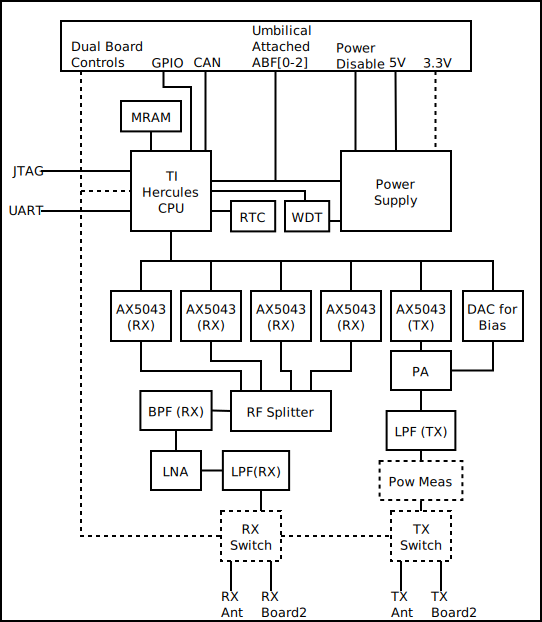

PacSat AFSK Board Interface Control Document
============================================

March 10, 2026
Revision: 0.2

## Version History

| Revision | Date         | Author(s)         | Change Log |
|--------- |------------- |--------------	  |----------- |
| 0.1      | 2024-10-10   | C Minyard (AE5KM) | Initial Revision|
| 0.2      | 2026-03-10   | C Minyard (AE5KM) | Rework for Version 3|

# Introduction

This document describes how the PacSat AFSK board interfaces with
other boards and system components of a satellite.  It describes both
hardware and software interfaces.

# System Description

The figure below show the block diagram of the PacSatAFSK board:

Not show are control and telemetry lines from the CPU to various parts
of the system and clock distribution, as that would clutter the
diagram unnecessarily.  It does not show temperature measuring
devices, for example.

The top of the diagram shows connections to the PC104 connector, the
bottom shows RF connections to antennas and to the redundant board.

See the Design document for details on the board internals.  This
section just provides an overview.

## Physical Board Layout

The board uses the physical layout described by the Pumpkin Space
CubSatKit(TM) PCB specification at
https://www.pumpkinspace.com/supporting-documents.html

## Power Supply

The power supply takes 5V and optionally 3.3V and uses that to supply
the rest of the board.  If 3.3V is not externally supplied, a buck
regulator can convert 5V to 3.3V when installed.  Power inputs have
inductors to control surge current on power up.

An external power disable line, HW\_POWER\_OFF[12]\_N, allows an
external device to power down all parts of the board except for +5VAL,
as described below.

Three different umbilical attached lines, call ABF[0-2], come in to
the board.  They shut down power to other parts of the system.  See
the Umbilical Attachment section for details.

The power supply has separate power zones for different parts of the
board.  These are:

* +5V - The main power input for 5V.

* +5VAL - This provides +5V whenever power is applied.  It is used to
  power the batter input for the RTC, the RX/TX switches (so the
  redundant board can access the antenna even if this power is powered
  off), the switches on the dual-board control lines (so the other board
  can control and access this board even when this board is powered
  off), and the CAN bus transceivers (so they can properly go tristate
  even if the board is off).  This is current limited to 200ma.
  
* +1.2V - Main power for the CPU.  HW\_POWER\_OFF[1-2]\_N will disable
  this.  This is regulated to 700ma maximum.  Power comes from a buck
  regulator (either 5V or 3.3v depending on configuration).

* REG_3.3V - Either the 3.3V externally, or the output of the 3.3V buck
  regulator, depending on how the board is configured.  This is used
  for some control and the watchdog timer so they are available even
  when the board is powered off by the WDT.
  
* +3.3V - This is the main I/O supply for the CPU and power for the
  MRAMs and the RTC.  It is current limited to 640ma.
  
* +3.3VAL - Supplies power to the RF switches, which run on +3.3V and
  must be powered when the board is disabled.  It derives from +5VAL,
  so will be off when +5.5VAL is off.
  
* AX5043_3.3V - This is a separately switched power, off by default,
  that powers all the AX5043 chips.  The CPU must enable power to
  these through a GPIO.  This is current limited to 200ma.
  
* SPPA_VCC - This is +5V to the PA.  This is off by default and the
  CPU must enable it with a GPIO before it can transmit.  In addition,
  as mentioned before, ABF0 line will disable this.  This is current
  limited to 640ma.
  
* LNA_VCC - This is +5V to the LNA.  This is off by default and the
  CPU must enable it with a GPIO before it can receive.  This is
  current limited to 200ma.

In addition, each AX5043 has a separate power control line from the
CPU.

## Temperature Measurement

Four temperature sensors are on the board, one by the CPU, one in the
power supply, one by the clock circuitry, and one near the PA.  These
are thermsistors that feed into A/D converters on the CPU.

## CPU

The TI Hercules CPU, a TMS5700914APGEQQ1 specifically, is a CPU
designed for automotive use.  It has two ARM Cortex-M4F processors
running in lockstep for detection of errors.  It does not have the
ability to split the CPUs for independent execution, the dual CPUs are
only used for lockstep processing.  It provides the I2C, SPI, and
GPIOs for controlling the rest of the board, and the CAN bus and GPIOs
for communicating off the board.

### CAN

The CAN bus is an automotive communication bus designed for harsh
environments.  It is used to communicate off the board.  Two CAN
busses are available.

### MRAM

2MB of MRAM is available on one of the SPI busses for storage of state
information.

### RTC

A real-time clock is available so the board has accurate time even
when off.  The battery input comes from +5VAL, and this has a large
diode-protected capacitor so that even if external power is not
available time can be kept for many hours.

### WDT

A watchdog timer on the board will power-cycle the CPU by disabling
+1.2V and +3.3V if the CPU does not toggle its FEED line once a
second.  Powering off the CPU will cause all other power except
REG_3.3V and +5VAL to be returned to their default, disabled, so it
effectively powers off the whole board.

## RX

The RF subsection consists of the section used for receiving signals.
It can receive on 4 different frequencies simultaneously.

### LPF (RX)

The Low Pass Filter on the antenna input keeps 440MHz from the
transmitter out of the receiver.  It has a relatively low loss (<1dB)
to keep the sensitivity of the receiver high.  It's cutoff is 176MHz.

### LNA

The Low Noise Amplifier provides ~20dB of gain to the input signal
from the LPF.

### BPF (RX)

The Band Pass Filter filters the output of the LNA to the 144-148MHz
band to avoid aliasing in the AX5043 chips and to remove strong
signals that might affect RX.

### RF Splitter

The RF splitter takes the output of the BPF (at 50 ohms) and splits it
into four separate signals (at 50 ohms).  Each signal is about 6.5dB
lower than the input signal.

### AX5043 (RX)

The AX5043 receivers take the RF from the splitter and receive AFSK
signals.  They may be configured to receive other FSK-type signals,
too.  The processor communicates with these over a SPI bus.

## TX

The board has one transmitter for sending FSK-type signals.  The main
transmission format is G3RUH, though it can dynamically switch to
other FSK modulation formats under software control.  It can transmit
at approximately 31dBm, though this can be reduced in the AX5043.  It
is designed for the 430-440MHz range.

### AX5043 (TX)

The AX5043 receives data over SPI from the CPU for transmission.
There is some filtering done on the output of this.

### PA

The PA takes the signal from the AX5043 and amplifies it to up to
33dBm.

### DAC for Bias

The bias for the PA comes from a DAC on the SPI bus.  This allows the
bias to be controlled to change the efficiency and amplification of
the PA.  For fixed bias, the DAC can be removed and a resistor
installed.

### LPF (TX)

The LPF on the output of the PA reduces output noise.  It's 3dB cutoff
is 460MHz.  It introduces ~2dB of loss, giving the maximum 31dBm power
output.

### Power Measurement

An optional power measurement circuit provide transmit power
measurements with a directional coupler on the board.  This can
measure both forward and reflected power.  It can be depopulated if
not required.

## Dual Board Fault Tolerance

The board, as described in the design document, can operation in a
dual-board fault tolerant configuration.  Only one board can transmit
or receive at a time.  These signals and switches allow two boards to
control each other and communicate so they can decide that one board
is active and the other is standby.  If a board fails, the other board
can detect this, take over operation, and power cycle the failed board
to hopefully bring it back up.  If a board has a hard failure, the
other board can disable it.

The MRAM software subsystem keeps the MRAMs on the boards in sync over
the CAN busses so the standby board can take over operation seamlessly
when it becomes active.

The boards are called "board1" and "board2".  A resistor on the board,
R91, tells the CPU which board it is.  Absence of R1 makes it board 1,
presence makes it board 2.

With R94 installed, an external device must decide which board is
active and which is standby by driving the ACTIVE1\_N or ACTIVE2\_N
lines.

This entire section is optional and may be removed.  Bypass zero-ohm
resistors can connect the few lines required for operation.

board2 does not have the RF portion (TX/RX Switch) of this populated
(or has it disabled and bypassed).  Board 1 does All TX/RX switching.

### TX Switch

The TX switch switches the TX antenna between board1 and board2.  It
uses the active line for board1 to do this.  The inactive board has
its TX sent to 50 ohms.  The ACTIVE1\_N lines controls the switch, so
that the antenna hooks to board 1 when active, and board 2 when
inactive.

### RX Switch

The RX switch switches the RX antenna between board1 and board1.  It
uses the active line for board1 to do this.  The inactive board has
it's RX sent to 50 ohms.  The ACTIVE1\_N lines controls the switch, so
that the antenna hooks to board 1 when active, and board 2 when
inactive.

# System Interfaces Description

This section defines the interfaces used to interact with the PacSat
AFSK board.

All connections to the CSKB connectors H1 and H2 can be moved to
different pins as required.

All I/O runs at 3.3V.

## PC104 Connector

In normal operation, most power signals come in/out of the PC104
connector.  Though referred to as PC104; it only uses the physical
connector that PC104 uses.  It does not implement an actual PC104 bus.
It actually consists of two 52-pin connectors, H1 and H2, where H1 is
the bottom connector (furthest from the top board edge) and H2 is the
top connector (right by the top board edge).

Pin 1 of the connectors is at the bottom left of each connector.

See the PC104\_IO page of the schematic for locations of the
connections.

### Power

The board can run on just external +5V if configured with a 3.3V
regulator, or it can run on external +5V and +3.3V.  External power
interfaces have inductors to regulate surge at startup.

The default power pins are the ones defined by the ISIS ICEPS2 power
supply, and a zero-ohm resistor can choose either the man +5V/+3.3V
inputs, or one of the three secondary switched inputs, on the Cube Sat
Kit Bus interface.

  - 5V\_p - +5V that is always present when the satellite is powered.
    The board has a 0 ohm resistor that must be populated to get power
	from these pins.

  - 3V3\_p - +3.3V that is always present when the satellite is powered.
    The board has a 0 ohm resistor that must be populated to get power
	from these pins.

  - 5V\_S[1-3] - Switched +5V power from the power supply.  The board
    has 0 ohm resistors, one of which must be populated to get power
    from these pins.

  - 3V3\_S[1-3] - Switched +3.3V power from the power supply.  The
	board has a 0 ohm resistor that must be populated to get power
	from these pins.

  - GND

A power disable, named HW\_POWER\_OFF[12]\_N, can be used to disable
power on the board.  There are two different ones for to allow for two
different boards.  If stand-alone, use HW\_POWER\_OFF1\_N.  If this is
pulled low, all power zones but +5VAL will be off.  This is pulled
high on the board, so it does not have to be driven.  This is part of
the dual-board controls, but in a simplex situation it can be used to
externally control power on the board.

### Umbilical Attachment

The ABF[0-2] signals tell the board that the satellite is in the
launch vehicle.  An external module (generally the power supply)
asserts to ground when in the launch vehicle; otherwise resistors pull
them high when not in the launch vehicle.

ABF0 inhibits the RF power amplifier.  If this is low the power
amplifier will not receive power from +5V.

ABF1 inhibits +5VAL, which normally supplies power to some parts on
the board even when the board is disabled.  If this is powered off,
the RF switch on the RF output will be disabled and thus disconnected
from the antenna.

ABF2 inhibits power to the rest of the system.  Disabling this will
cause all things on the board to be powered off except the RTC.

This provides three separate inhibits for RF transmission.

If lab testing, either provide pull ups to an external +3.3V line, or
make the following changes to the board:

Install R64 to pull up ABF0.

Install R54 to pull up ABF1.

Remove U41 to disable ABF2.

You may also need to remove the resistors connecting ABF0 and ABF1 to
the PC104 if those pins perform other functions.  These are resistors
R125 and R134.

Note that if you use the ABF lines, you must also supply 3.3V_p to
power the logic gate for ABF2.

  - PC104\_ABF[0-2] - Input to the board, if high the satellite is in
    the launch vehicle.  This turns off all power except the RTC
	and in addition inhibits transmit in hardware.
	
### CAN Bus

The board has two CAN busses, CANA and CAN.  External entities use
these to supply control and telemetry information.  The board can send
control information to other boards over this.

This interface is only capable of CAN 2.0, it cannot do CAN FD or CAN
XL.  A protocol design to do messaging over the 8-byte CAN 2.0
packets is described in a later section, CAN Bus Messages, along with
the messages themselves.  The pins are:

  - CAN[AB][+-] - CAN bus signals.

### I2C

An I2C bus is wired to the CSKB.  Termination is provided on the
PacSat board, though it could be removed if necessary.

The default pins for this are chosen as defined in "Standardization
Approaches for Efficient Electrical Interfaces of CubeSats" at
https://www.researchgate.net/publication/354837502_Standardization_Approaches_for_Efficient_Electrical_Interfaces_of_CubeSats?enrichId=rgreq-3c8f3f7a94bf0ca750dcd71e69db6025-XXX&enrichSource=Y292ZXJQYWdlOzM1NDgzNzUwMjtBUzoxMDcxODgzMjE0NjYzNjgxQDE2MzI1NjgyODEyNzE%3D&el=1_x_2&_esc=publicationCoverPdf

These can be electrically removed from the bus by a signal from the
processor (PC104\_SPI\_EN\_N), so that in a dual-board situation only
one device drives the bus.  See the design document for details.  The
pins are

  - PC104\_I2C\_SDA, PC104\_I2C\_SCL

### SPI

A standard four-line SPI bus runs to the PC104 connector from the
processor.

These can be electrically removed from the bus by a signal from the
processor (PC104\_SPI\_EN\_N), so that in a dual-board situation only
one device drives the bus.  See the design document for details.  The
pins are

  - PC104\_SPI\_CLK, PC104\_SPI\_CS, PC104\_SPI\_SIMO, PC104\_SPI\_SOMI

### GPIOs and ADC

Four GPIOs rum from the CPU to the PC104 connectors.  They can all be
either inputs or outputs; they are tristate by default.

Two ADC inputs can be used to measure analog values.

The pins are:

  - EXT\_GPIO1 - This pin can cause an interrupt to the CPU.  The rest
    of the pins cannot cause interrupts.
	
  - EXT\_GPIO[2-4] - General purpose I/O lines.
  
  - EXT\_ADC[1-2] - Analog to Digital controller inputs.
  
The board does not have a dedicated safe mode input or output, but one
of the GPIO pins can be assigned to that function.

### Dual Board Controls

This is considered an internal interface between two PacSat boards,
used for fault tolerance.  Even though it runs over the CSKB
connector, it's not exactly and external interface, though it is
possible for an external entity to control the active/standby
configuration of the boards.  See the design document for details on
this.

Some of these, namely FAULT1\_N and PRESENCE1\_N, might be useful for
monitoring the board.  See the design document for details.

The signal for this are:

  - HW\_POWER\_OFF[12]\_N - Input to board, pulling this low causes the
    power to be disabled on boardn.  boardn pulls this high with a 10K
	resistor.  If driven, it should be open drain or open collector.
	Be careful not to glitch this line.

  - PRESENCE[12]\_N - The board is physically present.  This must be
	pulled high by a 1M resistor on entity reading this value, it is
	pulled low by a 10K resistor on boardn.
	
  - ACTIVE[12]\_N - boardn is asserting that it is active.  This is
	pulled high on boardn and will be driven low by boardn when it is
	active and not under external active/standby control.  When under
	external active/standby control, this is an input that another
	entity must pull low to cause the board to go active.
	
  - FAULT[12] - Output from boardn, the processor is reporting an error.
    Positive logic (high is fault), open drain.

### PC104 Pin Disconnects

Almost all lines on the PC104s can be disconnected for functions that
are not used.

FAULT1, FAULT2, PRESENCE1\_N, PRESENCE2\_N - Remove U24

ACTIVE1\_N, ACTIVE2\_N, HW\_POWER\_OFF1\_N, HW\_POWER\_OFF2\_N - Remove U30

CANB+, CANB- - Remove U22, R89, and R90

CANA+, CANA- - Remove U14, R50, and R51

EXT\_SPI\_SOMI - Remove U42

EXT\_SPI\_SIMO - Remove U43

EXT\_SPI\_CLK - Remove U44

EXT\_SPI\_CS - Remove U45

PC104\_I2C\_SDA - Remove U32

PC104\_I2C\_SCL - Remove U38

EXT\_ADC1 - Remove R141

EXT\_ADC2 - Remove R143

EXT\_GPIO1 - Remove R142

EXT\_GPIO2 - Remove R149

EXT\_GPIO3 - Remove R148

EXT\_GPIO4 - Remove R150

PC104\_TX2 - Remove U39

PC104\_RX2 - Remove U40

PC104_ABF0 - Remove R125

PC104_ABF1 - Remove R134

PC104_ABF2 - Remove U41

## RF Connections

### Main Connections

The Version 3 and later boards have an MMCX connector, P15 for
transmit and P17 for receive for connecting to the antennas.  The
receiver has significant filtering above 160MHz; you can transmit and
receive simultaneously with nearby antennas without issues.

Version 3 boards also two U.FL connectors, P23 for transmit and P24
for receive (not populated by default), that can also be used for
antenna connections.

Version 2 boards have two U.FL connectors, P15 for transmit and P17
for receive, for antenna connections.

### Diplexer

In addition, a single antenna can be shared by the transmitter and
receivers using the diplexer on the board.  You must add the
components; they are not installed by default.  The receiver has
sufficient filtering to avoid transmit at 440MHz from affecting
reception.  The RF input and RF output connectors can be removed in
that case as well as the bleed-off inductors on the RF input and
output.  This option costs about 1dB on both transmit and receive.

### Other RF connections

All boards have various U.FL connectors (not necessarily populated on
Version 3 and later boards) on the bottom of the board.  These are
mostly used for isolating and testing circuits.  However, they could
be used for bringing out or injecting signals.  For instance:

* If you wanted to be able to receive 160MHz or below on an external
  board, you could disable or remove one of the AX5043s and route it's
  RF splitter output to another board.  There are obvious places for
  doing this.

* If you wanted to bring in your own receive signal, there are obvious
  places for that.  This could be used, for instance, if you have an
  external downconverter to hook to the board and you didn't need the
  filtering and/or LNA.

* If you wanted to route the output of the AX5043, or the direct
  output of the PA, to another board.  This could be used for an
  external amplifier or and external upconverter.

### Dual Board Controls

On a simplex board, RX Antenna and TX Antenna provide separate
connections to a 144MHz receive antenna and a 440MHz transmit antenna.
The RX Board2 and TX Board2 connections are not used in this
configuration.

In a dual-board configuration, board 1 has the RX Antenna and TX
Antenna connection to the antennas.  The RX Board2 connection on board
1 is then wired to the RX Antenna connection on board2.  And the TX
Board2 connection on board 1 is then wired to the TX Antenna
connection on board2.  Board 1 will switch the external antenna
between the two boards depending on the value of the ACTIVE1\_N line.
See the design document for more details.

# Programming and Debug Interfaces

The board has two main interfaces for programming and debugging: A
JTAG interface and a serial port interface.

The JTAG is the primary programming interface, though capability to
program the device could be done over the serial port.

## JTAG

An ARM standard 10-pin JTAG header is provided on one edge of the
board, as described at
https://software-dl.ti.com/ccs/esd/documents/xdsdebugprobes/emu_jtag_connectors.html

To use the JTAG interface, the watchdog timer must be disabled or the
processor will be continuously reset.  A standard 2.54mm (.1") header
is provided at J4; when a jumper is installed the watchdog timer will be
disabled.

## Serial Port

A 3.3V serial port interface is provided on the edge of the board.
This is a standard 2.54mm (.1") header with three pins: TX, RX, and
ground.  Remember, when connecting to an external serial port, connect
TX to RX and RX to TX.

Only connect a 3.3V serial port interface.  Connecting a 5V or
standard RS-232 connection will likely damage the processor.
Connecting external TX to TX on the board will likely damage the
processor, and probably the external serial port, too.

## LP-XDS110 JTAG/Serial Debug Probe

TI sells the "XDS110 LaunchPad Debug Probe", part number LP-XDS110,
that is an inexpensive programming interface that can do both JTAG and
the serial port.

See the Design document for details.

# Board Configuration

The PacSat board has a large number of configurations that can be
done.  See "Board Configuration" in the design document

# CAN Bus Messages

TBD
